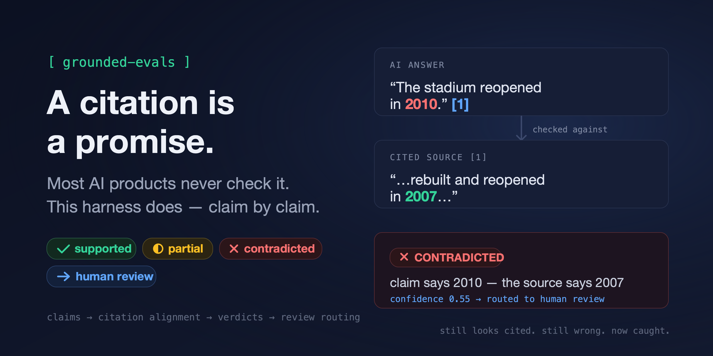

# grounded-evals

<p align="center">
  
</p>

**An evaluation harness for retrieval-grounded generation. A citation is treated as a machine-checkable contract between an answer and its sources — this repo checks the contract.**

Generative systems earn trust when their output is accountable to something real. For a text-to-3D system that means physics and navigability; for a retrieval-grounded answer it means *citations that actually support the claims they are attached to*. Most RAG pipelines measure retrieval quality and answer quality separately, and never verify the link between them. That link is where grounded systems quietly fail: the answer is fluent, the sources are relevant, and the specific sentence a user relies on is supported by none of them.

`grounded-evals` evaluates that link, claim by claim.

## What it measures

Given `(question, generated answer with citations, source corpus)`:

| Stage | What happens |
|---|---|
| **1. Claim extraction** | The answer is decomposed into atomic, self-contained claims. Rhetoric, hedges and connective tissue are marked not-checkable; factual assertions survive with their specificity (numbers, names, dates) intact. |
| **2. Marker resolution** | Citation markers are resolved to corpus documents — `[1]` means the first doc in the source list, `[wembley]` means the doc with that id. Unresolvable markers stay visible in the report instead of being dropped. |
| **3. Citation alignment** | Each claim's citations are resolved to concrete source spans — not "document 3," but the sentences the citation points at. Generator quotes are located exactly (tolerating whitespace/case drift); otherwise lexical overlap proposes candidate spans. Span offsets round-trip: `doc.text[start:end] == span.text`, always. |
| **4. Faithfulness verdict** | Each claim gets a verdict against its aligned spans: `SUPPORTED` (spans, singly or jointly, entail the claim), `PARTIAL` (spans support a strictly weaker version), `CONTRADICTED` (spans state something incompatible — a different number, an opposite fact), or `UNSUPPORTED` (spans are silent). Contradicted and unsupported are never collapsed: the source *saying otherwise* and the source *saying nothing* are different product failures. |
| **5. Review routing** | Verdicts carry confidence. Low-confidence verdicts — including the confidence-0.0 sentinel a failed judge emits — are never silently accepted or rejected; they are routed to a human review queue. The design assumption throughout: automated signals have a boundary, and the system should know where it is. |

## Metrics

All ratios are `None` when there is nothing to measure — never a fake `0.0`.

- **Citation recall** — the fraction of checkable claims that carry at least one citation.
- **Citation precision** — of cited claims, the fraction whose citations fully support them.
- **Per-citation precision** — of individual citations, the fraction that contributed a supporting span. A claim citing `[1][2]` where only `[1]` supports it is over-citing; claim-level precision can't see that, this can.
- **Contradicted rate / unsupported rate** — tracked separately (see stage 4), plus their sum as the **ungrounded rate**: the headline trust-erosion number.
- **Partial-support rate** — separate from both, because right-idea-wrong-number is the sneakiest failure: it reads as cited and is almost right.
- **Abstention quality** — on batch datasets, rows marked unanswerable score whether the system correctly declined (correct-refusal rate) and answerable rows score false refusals.
- **Review load** — the fraction of verdicts below the confidence threshold. A grounding pipeline that routes 40% of its verdicts to humans does not scale; one that routes 0% is not being honest about its judge.

## The judge is also under test

An unvalidated LLM judge is just a second opinion with better formatting, so the judge is measured like any other model:

- [`fixtures/labelled_claims.jsonl`](fixtures/labelled_claims.jsonl) — 60 claims with gold verdicts, tagged by failure mode: numeric swaps, numeric gaps, negations, paraphrases, multi-span synthesis, verbatim traps (high lexical overlap, wrong meaning), scope qualifiers, and prompt-injection attempts hidden in span text.
- `python -m grounded_evals.agreement` runs any judge against the fixtures and reports overall and per-class agreement, a confusion matrix, per-tag accuracy, confidence calibration (10-bin, with expected calibration error), and a threshold sweep with `recommend_threshold(target_accuracy)` — selective evaluation: pick the review threshold from labelled data, not intuition.
- The deterministic `MockJudge` is the floor to beat. Currently: **65% overall agreement** — 100% on numeric swaps/gaps (numbers are load-bearing and checked first), 0% on negation, paraphrase and verbatim traps, and calibration too poor for any threshold to reach 90% auto-accept accuracy. That profile is the point: a lexical proxy catches exactly what lexical signals can catch, and a model-backed judge must beat both the agreement number and the calibration before its confidences mean anything.

## Validate against public benchmarks

`grounded_evals.adapters` converts public benchmark data (not vendored — bring your own download) into this harness's formats: **RAGTruth** QA records become runner datasets, and its human span labels become agreement fixtures — the conflict/baseless label taxonomy maps directly onto contradicted/unsupported, so externally annotated ground truth grows the labelled set the judge is scored against. **ALCE** result files become runner datasets whose `[1]`-style markers exercise the marker-resolution layer natively, measuring citation recall/precision exactly as ALCE defines them.

## The human-review loop is a loop

`python -m grounded_evals.runner data.jsonl --out report.json --review-queue queue.jsonl` batch-evaluates a JSONL dataset and exports every below-threshold verdict for annotation (`"gold": null`, waiting to be filled). `review.ingest_adjudications` merges the filled queue back — human verdicts override at confidence 1.0, every metric recomputes — and `review.to_fixture_rows` converts adjudications into fixture format, so human labels continuously grow the labelled set the judge is measured against. Reports embed the judge fingerprint (model, prompt version) and package version, so every number is reproducible.

## Run it

```bash
pip install -e .[dev]
python examples/run_eval.py                      # mock judge, bundled corpus — no keys needed
python -m grounded_evals.runner examples/dataset.jsonl --out report.json
python -m grounded_evals.agreement               # judge-agreement floor on the fixture set
GROUNDED_EVALS_JUDGE=llm \
GROUNDED_EVALS_MODEL=<model> \
GROUNDED_EVALS_API_KEY=<key> \
python examples/run_eval.py                      # real judge (OpenAI-compatible or native Anthropic endpoints)
```

Output is an `EvalReport`: per-claim verdicts with aligned spans and the supporting-span subset, aggregate metrics, and the review queue.

## Design notes

- **Judges are pluggable.** `judge/llm.py` speaks OpenAI-compatible `chat/completions` and Anthropic's native Messages API (auto-detected from the base URL), with bounded backoff on transient HTTP failures. `judge/mock.py` is deterministic and runs the full pipeline in CI with no keys and no network. Judge JSON is parsed *and validated* (types, ranges, span-index bounds) and retried with the error fed back; a terminally failed verdict becomes the confidence-0.0 sentinel and lands in the review queue, never a silent pass.
- **Configuration is explicit.** The judge takes `model`/`api_key`/`base_url` as constructor arguments; `LLMJudge.from_env()` is the single place environment variables are read.
- **Prompts treat sources as hostile.** Answer and span text are fenced as data, never instructions — source documents are an injection surface for a verification system, and the fixture set includes injection attempts to prove the judge holds.
- **Everything is a dataclass.** `Claim`, `SourceSpan`, `Alignment`, `JudgeVerdict`, `ClaimResult`, `EvalReport` — the pipeline is inspectable at every stage, and every verdict is traceable to the exact source text it was judged against, at exact character offsets.
- **CI enforces the bar**: ruff, mypy, the full test suite (including the LLM judge under a stubbed transport), and smoke runs of every CLI.

## Scope, honestly

This is an evaluation harness, not a serving system. It does not do retrieval, chunking or index management — it assumes you have a grounded answer and asks whether the grounding is real. The verdict layer is deliberately independent of alignment, so it can consume pre-aligned spans from decode-time citation APIs just as well as lexically-proposed ones. It is the citation-domain sibling of the evaluation layer I run in production for generative 3D (geometry, collision and navigability checks, model-judged prompt adherence, human review at the automation boundary): a different medium, the same contract.

## Author

Amit Pate — [amitpate.github.io](https://amitpate.github.io)

MIT License
